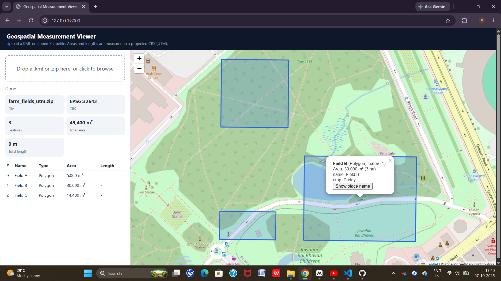

# Geospatial Measurement API

A FastAPI service that accepts a KML file or a zipped Shapefile, reads the geospatial features, and calculates the **area of polygons** and **length of lines** in meters.

The API also provides GeoJSON output and includes a simple map viewer for visualizing uploaded files.

## Features

* Upload KML files or zipped Shapefiles
* Read multiple KML layers
* Validate uploaded files
* Calculate polygon area in square meters
* Calculate line length in meters
* Automatically select a suitable UTM projected CRS
* Return feature information and GeoJSON
* Handle unsupported geometries without failing the complete file
* Interactive API documentation with Swagger UI
* Simple Leaflet-based map viewer
* Automated API and edge-case tests

## Setup

You need **Python 3.10 or newer**.

### 1. Clone the repository

```bash
git clone https://github.com/Pooja-malipatil/Geospatial-Measurement-API.git
cd Geospatial-Measurement-API
```

### 2. Create a virtual environment

```bash
python -m venv venv
```

### 3. Activate the virtual environment

**Windows:**

```bash
venv\Scripts\activate
```

**macOS/Linux:**

```bash
source venv/bin/activate
```

### 4. Install dependencies

```bash
pip install -r requirements.txt
```

### 5. Start the API

```bash
uvicorn app.main:app --reload
```

The API will be available at:

* API documentation: http://127.0.0.1:8000/docs
* Map viewer: http://127.0.0.1:8000/

### Run tests

```bash
pytest -v
```

The first test run may take some time because the geospatial libraries take longer to load.

Sample files are available in the `sample/` folder.

---

## API Endpoints

| Method | Path                            | Description                                                    |
| ------ | ------------------------------- | -------------------------------------------------------------- |
| POST   | `/api/files/`                   | Upload a `.kml` file or `.zip` containing a Shapefile          |
| GET    | `/api/files/{id}/`              | Get information about an uploaded file                         |
| GET    | `/api/files/{id}/measurements/` | Calculate area or length for each feature                      |
| GET    | `/api/files/{id}/features/`     | Get feature index, geometry type, geometry, CRS and properties |
| GET    | `/api/files/{id}/geojson/`      | Return shapes as GeoJSON in EPSG:4326                          |

---

## Upload a File

```bash
curl -F "file=@sample/test_plot.kml" http://127.0.0.1:8000/api/files/
```

Example response:

```json
{
  "id": "cd49c6e86f9a4b7ba43dbfd36d17399b",
  "filename": "test_plot.kml",
  "status": "COMPLETED",
  "crs": "EPSG:4326",
  "feature_count": 3
}
```

---

## File Information

### Request

```text
GET /api/files/cd49c6e86f9a4b7ba43dbfd36d17399b/
```

### Response

```json
{
  "id": "cd49c6e86f9a4b7ba43dbfd36d17399b",
  "filename": "test_plot.kml",
  "feature_count": 3,
  "crs": "EPSG:4326",
  "status": "COMPLETED",
  "error": null
}
```

---

## Measurements

### Request

```text
GET /api/files/cd49c6e86f9a4b7ba43dbfd36d17399b/measurements/
```

The API calculates:

* Polygon area in square meters
* Line length in meters
* No measurement for points or unsupported geometries

KML files may contain additional default fields such as `tessellate` and `extrude`. These are omitted from the example below for simplicity.

### Example response

```json
{
  "id": "cd49c6e86f9a4b7ba43dbfd36d17399b",
  "crs": "EPSG:4326",
  "measurements": [
    {
      "index": 0,
      "geometry_type": "Polygon",
      "properties": {
        "Name": "Test Plot"
      },
      "supported": true,
      "projected_crs": "EPSG:32643",
      "area_sq_m": 12016.97,
      "length_m": null,
      "note": null
    },
    {
      "index": 1,
      "geometry_type": "LineString",
      "properties": {
        "Name": "Test Road"
      },
      "supported": true,
      "projected_crs": "EPSG:32643",
      "area_sq_m": null,
      "length_m": 155.044,
      "note": null
    },
    {
      "index": 2,
      "geometry_type": "Point",
      "properties": {
        "Name": "Test Point"
      },
      "supported": false,
      "projected_crs": null,
      "area_sq_m": null,
      "length_m": null,
      "note": "No measurement required for points."
    }
  ]
}
```

---

## Error Handling

Errors are returned in the following format:

```json
{
  "detail": "message"
}
```

| Status Code | Description                                                                                |
| ----------- | ------------------------------------------------------------------------------------------ |
| `400`       | Wrong file type or empty file                                                              |
| `404`       | File ID not found                                                                          |
| `409`       | Measurements requested for a file that is not `COMPLETED`                                  |
| `422`       | File could not be read, such as broken KML, invalid ZIP, missing `.shp`, or missing `.prj` |

---

## Architecture

### Application Structure

```text
app/
├── main.py
├── routers/
│   └── files.py
├── services/
│   ├── geo_reader.py
│   └── measurements.py
└── static/
    └── index.html

tests/
└── test_api.py

sample/
└── example files
```

### Responsibilities

* `main.py` creates the FastAPI application and registers routes.
* `routers/files.py` handles HTTP requests, validation, status codes and responses.
* `services/geo_reader.py` reads KML and zipped Shapefile data.
* `services/measurements.py` handles CRS selection and area/length calculations.
* `static/index.html` provides the map viewer.
* `tests/test_api.py` contains automated tests.
* `sample/` contains example files for testing.

The router handles the HTTP layer, while the geospatial logic is kept in the service layer. This keeps the core geospatial processing independent of FastAPI.

---

## File Processing Flow

1. The uploaded file is checked.
2. Only `.kml` and `.zip` files are accepted.
3. Empty files are rejected.
4. The file is saved using a generated ID instead of the original filename.
5. GeoPandas reads the uploaded data.
6. For KML files, all available layers are read and combined.
7. For ZIP files, the `.shp` file is located even when it is inside a sub-folder.
8. Each feature keeps its index, geometry type, geometry, CRS and properties.
9. Successfully processed files receive the `COMPLETED` status.
10. If processing fails, the file receives the `FAILED` status and the API returns the reason.

---

## Measurement Flow

When the `/measurements/` endpoint is called:

1. Points, empty geometries and unsupported geometry types are skipped.
2. Polygon and line geometries are converted to a suitable projected CRS.
3. Polygon area is calculated in square meters.
4. Line length is calculated in meters.
5. If one feature fails, only that feature receives an error note. Other features continue to be processed.

---

## CRS Handling

Latitude and longitude are represented in degrees. A degree does not represent a fixed physical distance, so calculating area or length directly using geographic coordinates can produce incorrect results.

To get measurements in meters, the API converts each supported geometry into an appropriate **UTM projected coordinate system**.

The UTM zone is selected based on the feature's location:

```python
zone = min(max(int((lon + 180) // 6) + 1, 1), 60)

epsg = (32600 if lat >= 0 else 32700) + zone
```

* `EPSG:326xx` represents UTM zones in the northern hemisphere.
* `EPSG:327xx` represents UTM zones in the southern hemisphere.

The transformation is performed using `pyproj` with `always_xy=True` so coordinates remain in `(longitude, latitude)` order.

The calculated area and length are then taken from the projected geometry.

The selected projected CRS is returned in the `projected_crs` field.

This approach allows the API to work with files using different source coordinate reference systems, not only EPSG:4326.

---

## Design Decisions

### FastAPI

FastAPI was selected because it is lightweight, provides automatic request validation, and generates interactive API documentation through Swagger UI.

### UTM Zone Per Feature

A UTM zone is selected for each feature based on its location. This provides accurate measurements for small and medium-sized areas while keeping the implementation relatively simple.

Other approaches, such as an equal-area CRS or geodesic calculations using `pyproj.Geod`, could be used for larger or more complex datasets.

### GeoPandas

GeoPandas provides convenient support for reading and processing geospatial data and working with coordinate reference systems.

### Reject Shapefiles Without `.prj`

A `.prj` file provides the coordinate reference system information for a Shapefile.

Without CRS information, the API cannot reliably determine the correct measurement projection, so the file is rejected rather than returning potentially incorrect measurements.

### Read All KML Layers

KML files can contain multiple folders/layers. Reading all available layers prevents features from being silently missed.

### Generated File IDs

Uploaded files are stored using generated IDs instead of their original filenames. This avoids filename conflicts and reduces the risk of unsafe filenames.

### In-Memory Storage

Files are processed during the upload request and the file records are kept in memory. This keeps the project simple and avoids introducing a database for this version.

For production-scale usage, persistent storage such as PostgreSQL/PostGIS would be more appropriate.

### Unsupported Geometries

Unsupported geometries return a note instead of causing the complete request to fail. This allows other valid features in the same file to be processed.

---

## Map Viewer

Open:

```text
http://127.0.0.1:8000/
```

The map viewer allows you to:

* Upload a supported file
* Visualize shapes on a Leaflet map
* View measurement information
* Select a feature from the table
* Zoom to the selected feature

The viewer is a static HTML page served directly by FastAPI.



---

## What I Learned

Through this project, I learned:

* Why area and distance should not be calculated directly from latitude/longitude degrees.
* How projected coordinate systems such as UTM are used for measurements.
* How UTM zones are calculated.
* How coordinate axis order can affect transformations in `pyproj`.
* How KML files can contain multiple layers/folders.
* How Shapefiles consist of multiple related files.
* How to build REST APIs using FastAPI.
* How to separate API routes from business logic using service modules.
* How to test file-processing and geospatial edge cases.

---

## Future Scope

Possible improvements include:

* Add persistent storage using PostgreSQL/PostGIS.
* Add file-size limits for uploads.
* Process large files using background jobs.
* Improve measurement accuracy for geometries crossing multiple UTM zones.
* Support mixed geometries.
* Add support for additional formats such as KMZ and GeoJSON.
* Add unit conversions such as hectares, acres and kilometers.
