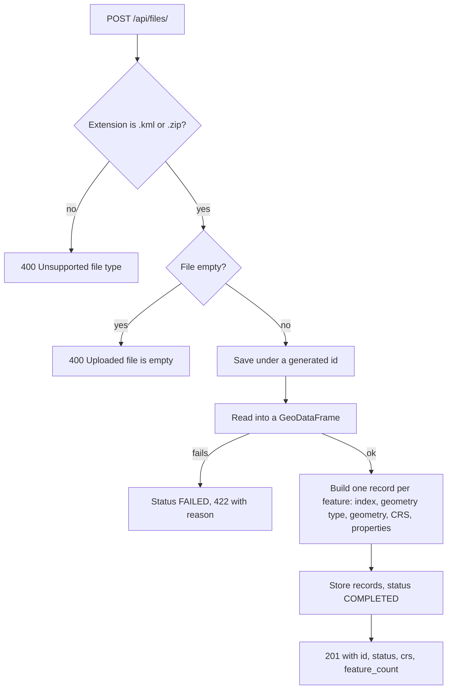
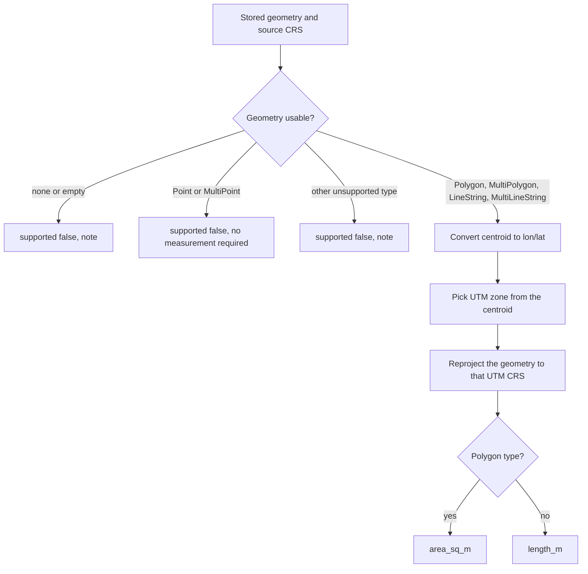

# Geospatial File Measurement API

A FastAPI backend that accepts a **KML** file or a **zipped Shapefile**, extracts every feature, and returns **area** (polygons) and **length** (lines) in square meters and meters.

Measurements are never taken on latitude/longitude degrees. Each feature is reprojected into its own **UTM zone** first, and the results were cross-checked against an independent geodesic calculation (see [Verification](#verification)).

A small **map viewer** is included as an extra: upload a file in the browser and see the shapes and their measurements on a Leaflet map.


---

## Table of contents

1. [Features](#features)
2. [Tech stack](#tech-stack)
3. [Quick start](#quick-start)
4. [API reference](#api-reference)
5. [Architecture](#architecture)
6. [Design decisions](#design-decisions)
7. [Verification](#verification)
8. [Error handling and security](#error-handling-and-security)
9. [Known limitations](#known-limitations)
10. [Learning and future scope](#learning-and-future-scope)

---

## Features

**Required by the assignment**

- `POST /api/files/` accepts a `.kml` or a `.zip` containing a Shapefile.
- Every feature is extracted with its **index, geometry type, geometry, CRS and properties**.
- **Polygon → area**, **LineString → length**, **Point → no measurement**.
- **CRS handling:** geometry is reprojected to a projected CRS (UTM) before measuring.
- Unsupported geometries are handled gracefully with a note, never a crash.
- `GET /api/files/{id}/` and `GET /api/files/{id}/measurements/`.

**Extras added on top**

- `GET /api/files/{id}/features/` returns the raw extracted features (all five required fields).
- `GET /api/files/{id}/geojson/` returns the shapes as GeoJSON in EPSG:4326 for map display.
- **Web viewer** at `/`: drag-and-drop upload, Leaflet map, summary cards, a measurement table, click-to-zoom rows, popups, and hover labels with feature names.
- Handles KML files with **multiple Folders/layers** (all layers are merged).
- Handles zips where the Shapefile sits in a **sub-folder**, and zips holding **several Shapefiles** (converted to one CRS).
- **13 automated tests** covering upload, validation, error paths, both file formats and measurement accuracy.
- Interactive API docs generated automatically at `/docs`.

---

## Tech stack

| Purpose | Library |
|---|---|
| Web framework | FastAPI, Uvicorn |
| File upload parsing | python-multipart |
| Reading KML / Shapefile | GeoPandas (pyogrio / GDAL) |
| Geometry objects | Shapely |
| CRS transformation | pyproj |
| Tests | pytest, httpx |
| Viewer | Leaflet 1.9.4 and OpenStreetMap tiles (plain HTML and JavaScript, no build step) |

---

## Quick start

```bash
git clone https://github.com/<your-username>/geo-measurement-api.git
cd geo-measurement-api

python -m venv venv
venv\Scripts\activate            # macOS / Linux: source venv/bin/activate

pip install -r requirements.txt
uvicorn app.main:app --reload
```

Then open:

| URL | What you get |
|---|---|
| http://127.0.0.1:8000/ | Map viewer |
| http://127.0.0.1:8000/docs | Interactive API documentation (try the endpoints here) |
| http://127.0.0.1:8000/health | Health check |

**Run the tests**

```bash
pytest -v
```

The first run takes around 30 seconds because the geospatial libraries are heavy to load.

**Try it with the bundled sample files** in `sample/` (see [Verification](#verification) for the expected results).

---

## API reference

| Method | Path | Purpose |
|---|---|---|
| `POST` | `/api/files/` | Upload and process a `.kml` or `.zip` (Shapefile) |
| `GET` | `/api/files/{id}/` | File information |
| `GET` | `/api/files/{id}/measurements/` | Per-feature measurements |
| `GET` | `/api/files/{id}/features/` | Per-feature index, geometry type, geometry, CRS, properties |
| `GET` | `/api/files/{id}/geojson/` | Shapes as GeoJSON in EPSG:4326 (used by the viewer) |
| `GET` | `/health` | Health check |

### Upload

```bash
curl -F "file=@sample/test_plot.kml" http://127.0.0.1:8000/api/files/
```

On Windows PowerShell use `curl.exe` instead of `curl`.

`201 Created`

```json
{
  "id": "cd49c6e86f9a4b7ba43dbfd36d17399b",
  "filename": "test_plot.kml",
  "status": "COMPLETED",
  "crs": "EPSG:4326",
  "feature_count": 3
}
```

### File information

```bash
curl http://127.0.0.1:8000/api/files/cd49c6e86f9a4b7ba43dbfd36d17399b/
```

`200 OK`

```json
{
  "id": "cd49c6e86f9a4b7ba43dbfd36d17399b",
  "filename": "test_plot.kml",
  "feature_count": 3,
  "crs": "EPSG:4326",
  "status": "COMPLETED",
  "error": null
}
```

`status` is `PROCESSING`, `COMPLETED` or `FAILED`. When a file fails to process, `error` holds the reason.

### Measurements

```bash
curl http://127.0.0.1:8000/api/files/cd49c6e86f9a4b7ba43dbfd36d17399b/measurements/
```

`200 OK` (the `properties` objects are shortened here: KML files also carry default fields such as `tessellate`, `extrude` and `visibility`)

```json
{
  "id": "cd49c6e86f9a4b7ba43dbfd36d17399b",
  "crs": "EPSG:4326",
  "measurements": [
    {
      "index": 0,
      "geometry_type": "Polygon",
      "properties": { "Name": "Test Plot", "...": null },
      "supported": true,
      "projected_crs": "EPSG:32643",
      "area_sq_m": 12016.97,
      "length_m": null,
      "note": null
    },
    {
      "index": 1,
      "geometry_type": "LineString",
      "properties": { "Name": "Test Road", "...": null },
      "supported": true,
      "projected_crs": "EPSG:32643",
      "area_sq_m": null,
      "length_m": 155.044,
      "note": null
    },
    {
      "index": 2,
      "geometry_type": "Point",
      "properties": { "Name": "Test Point", "...": null },
      "supported": false,
      "projected_crs": null,
      "area_sq_m": null,
      "length_m": null,
      "note": "No measurement required for points."
    }
  ]
}
```

### Features

```bash
curl http://127.0.0.1:8000/api/files/cd49c6e86f9a4b7ba43dbfd36d17399b/features/
```

Returns `{"id", "feature_count", "features": [...]}`. Each item has exactly the fields the assignment asks for, with the geometry in the file's original CRS (the third feature of the sample is shown):

```json
{
  "index": 2,
  "geometry_type": "Point",
  "geometry": { "type": "Point", "coordinates": [77.5905, 12.9705, 0.0] },
  "crs": "EPSG:4326",
  "properties": { "Name": "Test Point", "...": null }
}
```

### Status codes and error format

Errors always use the shape `{"detail": "<message>"}`.

| Code | When |
|---|---|
| `201` | File uploaded and processed |
| `400` | Unsupported extension, or the uploaded file is empty |
| `404` | Unknown file id |
| `409` | Measurements, features or GeoJSON requested for a file that is not `COMPLETED` |
| `422` | The file could not be read: corrupt KML, invalid zip, no `.shp` inside the zip, or a Shapefile without a `.prj` (no CRS) |

Examples:

```json
{ "detail": "Unsupported file type. Upload a .kml or a .zip (Shapefile)." }
{ "detail": "The zip does not contain a .shp file." }
{ "detail": "File not found." }
```

---

## Architecture

### Application structure

```
geo-measurement-api/
├── app/
│   ├── main.py                     # creates the app, registers the router, serves the viewer
│   ├── routers/
│   │   └── files.py                # HTTP layer: upload, info, measurements, features, geojson
│   ├── services/
│   │   ├── geo_reader.py           # reads KML / zipped Shapefile into plain feature dicts
│   │   └── measurements.py         # UTM selection, reprojection, area/length
│   └── static/
│       └── index.html              # Leaflet map viewer (no build step)
├── tests/
│   └── test_api.py                 # 13 tests
├── sample/                         # ready-to-upload KML and Shapefile zips
├── docs/screenshot.png
├── pytest.ini
├── requirements.txt
└── README.md
```

The router only deals with HTTP (validation, status codes, responses). All geospatial logic lives in `services/`, which has no knowledge of FastAPI and can be tested on its own.

### File-processing flow



Reading details:

- **KML:** every layer (one per Folder) is read and merged, with feature indexes renumbered 0, 1, 2… across layers. KML is always lon/lat, so the CRS is set to `EPSG:4326` if the reader does not report one.
- **Zip:** the archive is listed (not extracted), every `.shp` is found at any depth, and each is read in place. A Shapefile without a `.prj` is rejected instead of guessing a CRS. Several Shapefiles in different CRSs are converted to the first one.
- **Properties** are cleaned so they are JSON-safe: missing values become `null`, numpy numbers become plain numbers, dates become text.

### Measurement calculation flow

Measurements are computed when `/measurements/` is requested, from the stored features.



Each feature is measured independently inside a `try/except`, so one bad feature produces a note on that feature only and never breaks the response.

### CRS handling

Degrees are not a constant distance: one degree of longitude is about 111 km at the equator and shrinks toward the poles. Area and length calculated on degrees are therefore wrong.

**Strategy: one UTM zone per feature, chosen from its own centroid.**

```python
zone = min(max(int((lon + 180) // 6) + 1, 1), 60)
epsg = (32600 if lat >= 0 else 32700) + zone     # 326xx north, 327xx south
```

1. The centroid is converted to lon/lat to find where the feature is on Earth.
2. The matching UTM zone (60 strips, each 6° wide) is selected.
3. The geometry is reprojected with `pyproj` to that metric CRS.
4. Shapely's `.area` and `.length` then return square meters and meters.

Details that matter:

- All transformers use `always_xy=True`, which forces (longitude, latitude) order. Without it, EPSG:4326 can be read as (latitude, longitude) and silently swap the coordinates.
- Any source CRS works (EPSG:4326, a UTM zone, Web Mercator…), not only lat/long.
- Features in the same file can land in different UTM zones; the zone used is returned as `projected_crs`.

---

## Design decisions

| Decision | Why | Alternatives considered |
|---|---|---|
| **FastAPI** | Fast to build, automatic validation and `/docs`, simple async file upload | Django + DRF: heavier setup for a service this size |
| **UTM zone per feature** | Accurate for small and medium areas, easy to explain, no extra data needed | A single equal-area CRS such as EPSG:6933 (one CRS for everything, but less accurate locally); geodesic calculation with `pyproj.Geod` (most precise, but more code and different handling for lines and polygons with holes) |
| **GeoPandas for reading** | One API for KML and Shapefile, handles layers and CRS | Raw `fiona` or `ogr` (more code); `zipfile` plus a manual `.shp` parser (error-prone) |
| **Zip read in place** (`/vsizip/`) | Nothing is extracted to disk, so no zip-slip risk and no cleanup | Extract to a temp folder first |
| **Reject Shapefiles without a `.prj`** | Guessing a CRS would give wrong measurements with no warning | Assume EPSG:4326 |
| **Merge all KML layers** | Google Earth files put features in Folders; reading only the first layer would silently lose data | Read the default layer only |
| **Save uploads under a generated id** | Avoids name collisions and unsafe user-supplied filenames | Keep the original filename |
| **Synchronous processing in the request** | Simple flow, fine for small and medium files | Background queue (see future scope) |
| **In-memory store for records** | Fast to deliver, no database setup for the assignment | SQLite or PostgreSQL/PostGIS |
| **Graceful degradation per feature** | One bad geometry must not fail a whole file | Fail the whole request |
| **Static Leaflet page, no React build** | One command runs everything; easy for a reviewer to try | A separate React app (adds a second server and a build step) |
| **Service layer separate from router** | Geospatial code is testable without HTTP | Everything inside the route functions |

---

## Verification

### Automated tests

`pytest -v` runs 13 tests:

- Upload of a KML and of a zipped Shapefile, including a Shapefile inside a sub-folder of the zip
- Rejection of an unsupported extension and of an empty file
- A corrupt KML returns `422` and does not crash the server
- A zip with no Shapefile returns a clear `422` message
- File info, features (all five required fields), GeoJSON, and `404` for unknown ids
- Measurement correctness: projected CRS is UTM, polygon area and line length fall in the expected range, points are skipped
- An unsupported geometry type is handled with a note

### Accuracy cross-check

Beyond the tests, results were compared with an independent geodesic calculation (`pyproj.Geod`) on a varied set of files: KML and Shapefile inputs, EPSG:4326, a UTM CRS and Web Mercator (EPSG:3857), northern and southern hemispheres, polygons with holes, MultiPolygons and one very large polygon spanning several UTM zones. Differences were around 0.1% or less. A 100 m × 50 m square stored in UTM comes out as exactly 5,000 m².

### Sample files and expected results

| File (in `sample/`) | Contents | Expected result |
|---|---|---|
| `test_plot.kml` | Polygon, line and point near Bengaluru | Area 12,016.97 m², length 155.04 m, point skipped (UTM zone `EPSG:32643`) |
| `farm_fields_utm.zip` | Three fields stored in meters (`EPSG:32643`) | 5,000 m², 30,000 m², 14,400 m² (exact) |
| `lalbagh_plots_latlong.zip` | Four plots stored in lat/long | 11,537.10, 36,053.69, 7,571.14 and 18,026.65 m² |
| `world_places.kml` | Polygons and a line in New York, London, Sydney and Tokyo, plus two points | Four different UTM zones used: `32618`, `32630`, `32756`, `32654` |

The polygons in `world_places.kml` are rough rectangles for demonstration, not real park outlines.

---

## Error handling and security

- **Validation:** only `.kml` and `.zip` are accepted, and empty files are refused.
- **No crashes on bad input:** corrupt files, invalid zips, missing `.prj` and unreadable KML all return a clear `422` with the reason.
- **Unsupported geometry:** returned with `supported: false` and a `note`.
- **Safe file handling:** files are saved under a generated id, never the user's filename, and zips are never extracted to disk.
- **Viewer:** property values from uploaded files are HTML-escaped before display, so a malicious attribute cannot inject markup into the page.

---

## Known limitations

- Records are stored **in memory**: restarting the server clears them (the uploaded files remain in `uploads/`).
- Files are processed **synchronously** and there is **no upload size limit**, so very large files will be slow.
- A very large shape that crosses several UTM zones is measured in a single zone (about 0.1% off in my cross-check, but still an approximation).
- A KML placemark that mixes geometry types (for example a point and a line in one `MultiGeometry`) is read as a GeometryCollection and reported as unsupported instead of being measured part by part.
- KML files bring default fields (`tessellate`, `extrude`, `visibility`, …) that show up as properties.
- `.kmz` and other formats are not supported.
- The viewer needs an internet connection for the map tiles and the Leaflet library.

---

## Learning and future scope

### What I learned

- **Why CRS matters:** the difference between geographic and projected coordinates, why measuring in degrees is wrong, and how UTM zones are numbered.
- **A real pitfall:** the latitude/longitude axis-order trap in `pyproj`, solved with `always_xy=True`.
- **Working with real-world file structure:** KML Folders become separate layers, and Shapefiles arrive as zips that may hide the `.shp` in a sub-folder. I only found the sub-folder problem by testing with a varied set of files, then fixed it and added a regression test.
- **API design in FastAPI:** routers, a separate service layer, choosing precise status codes (`400`, `404`, `409`, `422`), and per-feature error isolation.
- **Verifying results:** cross-checking my measurements against an independent geodesic calculation, and testing with files whose correct answer is known (exact meter squares).

### Future scope

- Persist records in **PostgreSQL/PostGIS** instead of memory.
- Move parsing to a **background queue** (Celery or RQ) with polling on `status`, and add a **file size limit**.
- Offer a **geodesic measurement mode** (`pyproj.Geod`) and measure shapes that cross UTM zones accurately.
- Measure the parts of **GeometryCollections** and add perimeter for polygons.
- Support more formats: **KMZ, GeoJSON, GeoPackage**.
- Filter out KML default fields from properties.
- Pagination for files with thousands of features.
- Authentication and per-user file ownership.
- **Docker** setup and a **GitHub Actions** workflow that runs the tests on every push.